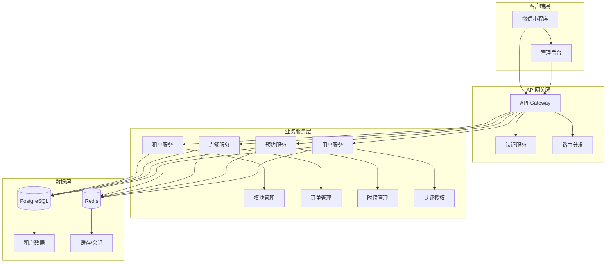
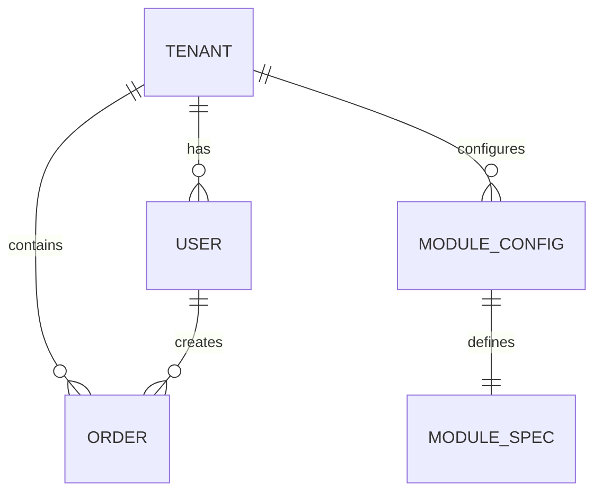

# 系统架构设计

## 整体架构

MiniModules 采用微服务架构，支持多租户和模块化部署。



## 模块化架构

### 模块加载机制

1. **配置获取**：小程序启动时调用 `/api/tenant/{id}/config`
2. **模块解析**：根据 `enabled_modules` 加载对应模块规范
3. **动态加载**：按需加载模块的页面和组件
4. **主题应用**：应用租户主题配置

### 模块规范

每个模块在 `packages/libs/module-spec/` 下定义规范：

```json
{
  "id": "ordering",
  "name": "点餐模块",
  "routes": [...],
  "config_schema": {...},
  "capabilities": [...],
  "dependencies": [...]
}
```

## 数据模型

### 租户隔离

所有业务数据通过 `tenant_id` 进行多租户隔离：

```sql
-- 示例：订单表
CREATE TABLE orders (
    id UUID PRIMARY KEY,
    tenant_id UUID NOT NULL,  -- 租户隔离
    user_id UUID,
    -- 其他字段...
);
```

### 核心实体关系



## API 设计

### RESTful API 规范

- 资源命名：使用复数形式，如 `/api/orders`
- HTTP 方法：GET(查询)、POST(创建)、PUT(更新)、DELETE(删除)
- 状态码：200(成功)、201(创建)、400(客户端错误)、500(服务器错误)

### 租户配置 API

```http
GET /api/tenant/{id}/config
```

响应格式：
```json
{
  "success": true,
  "data": {
    "tenant_id": "tenant_001",
    "industry": "restaurant",
    "enabled_modules": ["ordering", "user", "pay"],
    "theme": {
      "primaryColor": "#FF6A00",
      "logo": "..."
    },
    "ordering": {
      "time_slot_length": 30
    }
  }
}
```

## 部署架构

### 容器化部署

```yaml
# docker-compose.yml
services:
  api:
    build: ./packages/api
    ports: ["3000:3000"]
    depends_on: [postgres, redis]
  
  postgres:
    image: postgres:15
    environment:
      POSTGRES_DB: minimodules
  
  redis:
    image: redis:7
```

### Kubernetes 部署

```yaml
# k8s/deployment.yaml
apiVersion: apps/v1
kind: Deployment
metadata:
  name: minimodules-api
spec:
  replicas: 3
  selector:
    matchLabels:
      app: minimodules-api
  template:
    spec:
      containers:
      - name: api
        image: minimodules/api:latest
        ports:
        - containerPort: 3000
```

## 安全设计

### 认证授权

- JWT Token 认证
- 基于角色的访问控制 (RBAC)
- 多租户数据隔离

### 数据安全

- 敏感数据加密存储
- API 请求限流
- SQL 注入防护

## 监控与日志

### 应用监控

- 健康检查端点：`/health`
- 指标收集：Prometheus
- 日志聚合：ELK Stack

### 性能监控

- API 响应时间
- 数据库查询性能
- 缓存命中率

## 扩展性设计

### 水平扩展

- 无状态服务设计
- 数据库读写分离
- 缓存集群

### 模块扩展

- 插件化架构
- 动态模块加载
- 配置热更新
